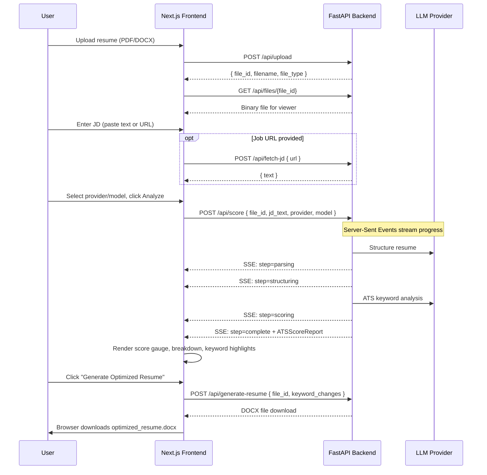
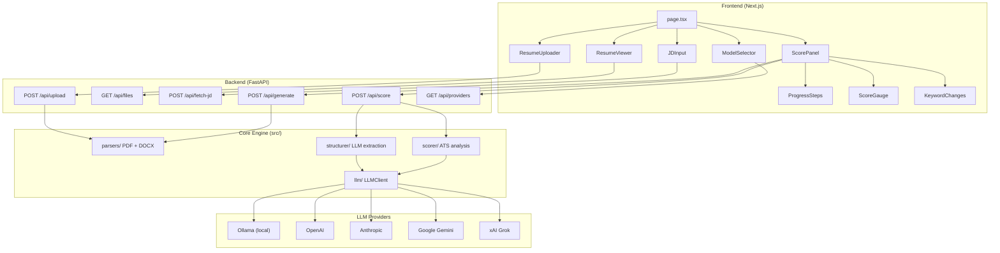

# ATS Resume Scorer

AI-powered resume analysis tool that scores your resume against any job description, highlights what to improve, and generates an optimized version — all through a modern web interface.

Supports multiple LLM providers: **Local (Ollama)**, **OpenAI**, **Anthropic (Claude)**, **Google Gemini**, and **xAI (Grok)** — selectable from a dropdown in the UI.

## Demo

<!-- Replace with your own screen recording or screenshots -->
<!-- To record: use macOS Cmd+Shift+5, or a tool like Kap (https://getkap.co) to export a GIF -->

> **Upload** a resume, **paste** a job description or **enter a URL**, and get an instant ATS match score with keyword-by-keyword suggestions.

| Step | Screenshot |
|---|---|
| Upload resume + enter JD | *Add screenshot: `docs/screenshots/01-upload.png`* |
| Real-time progress | *Add screenshot: `docs/screenshots/02-progress.png`* |
| Score + suggestions | *Add screenshot: `docs/screenshots/03-results.png`* |
| Download optimized resume | *Add screenshot: `docs/screenshots/04-download.png`* |

<!-- If you have a full demo GIF or video, embed it here:

-->

## Architecture

```
.
├── backend/       Python FastAPI server + core parsing/scoring engine
└── frontend/      Next.js web client
```

The **backend** exposes a REST API with Server-Sent Events for real-time progress. It uses the `openai` Python library as a unified interface for all OpenAI-compatible providers (Ollama, OpenAI, Gemini, Grok) and the `anthropic` library for Claude.

The **frontend** provides a two-panel UI: upload and preview your resume on the left, see the ATS match score, keyword suggestions, and highlighted improvements on the right. A dropdown in the header lets you pick the LLM provider and model.

### Data Flow



### Component Architecture



## Prerequisites

| Dependency | Version | Purpose |
|---|---|---|
| [Python](https://www.python.org/) | 3.12+ | Backend runtime |
| [uv](https://docs.astral.sh/uv/) | latest | Python package/project manager |
| [Node.js](https://nodejs.org/) | 18+ | Frontend runtime |
| [npm](https://www.npmjs.com/) | 9+ | Frontend package manager |
| [Ollama](https://ollama.com/) | latest | Local LLM inference (optional if using cloud providers) |

## Quick Start

### 1. Backend

```bash
cd backend
cp .env_sample .env     # copy and fill in your API keys
uv sync                 # install Python dependencies + create venv
uv run uvicorn api.main:app --reload --port 8000
```

The API will be available at `http://localhost:8000`. Verify with:

```bash
curl http://localhost:8000/api/health
```

### 2. Frontend

```bash
cd frontend
npm install            # install Node dependencies
npm run dev            # start dev server on port 3000
```

Open `http://localhost:3000` in your browser.

### 3. LLM Provider Setup

**Local (Ollama)** — default, no API key needed:

```bash
ollama serve                   # start the server
ollama pull qwen2.5-coder:7b   # pull the default model
```

**Cloud providers** — add your API key(s) to `backend/.env`:

```bash
# Pick one or more:
OPENAI_API_KEY=sk-...
ANTHROPIC_API_KEY=sk-ant-...
GEMINI_API_KEY=AIza...
XAI_API_KEY=xai-...
```

## Supported LLM Providers

All providers except Anthropic use the `openai` Python library with different `base_url` values. Anthropic uses its own `anthropic` SDK.

| Provider | Base URL | Default Model | Env Variable |
|---|---|---|---|
| **Local (Ollama)** | `http://localhost:11434/v1` | `qwen2.5-coder:7b` | None (no key needed) |
| **OpenAI** | `https://api.openai.com/v1` | `gpt-4o` | `OPENAI_API_KEY` |
| **Anthropic** | Anthropic SDK | `claude-sonnet-4-20250514` | `ANTHROPIC_API_KEY` |
| **Google Gemini** | `https://generativelanguage.googleapis.com/v1beta/openai/` | `gemini-2.0-flash` | `GEMINI_API_KEY` |
| **xAI (Grok)** | `https://api.x.ai/v1` | `grok-3-mini` | `XAI_API_KEY` |

## Backend Dependencies

| Package | Purpose |
|---|---|
| `fastapi` | Web framework (REST API) |
| `uvicorn` | ASGI server |
| `sse-starlette` | Server-Sent Events for streaming progress |
| `python-multipart` | File upload handling |
| `openai` | Unified client for OpenAI-compatible providers (Ollama, OpenAI, Gemini, Grok) |
| `anthropic` | Anthropic Claude SDK |
| `python-dotenv` | Load `.env` configuration |
| `pymupdf` | PDF text and layout extraction |
| `python-docx` | DOCX document parsing |
| `pydantic` | Data validation and serialization |
| `httpx` | HTTP client (job description fetching) |
| `beautifulsoup4` | HTML parsing (job description extraction) |

## Frontend Dependencies

| Package | Purpose |
|---|---|
| `next` | React framework (App Router, SSR) |
| `react` / `react-dom` | UI library |
| `react-pdf` / `pdfjs-dist` | PDF rendering in the browser |
| `mammoth` | DOCX to HTML conversion (client-side preview) |
| `tailwindcss` | Utility-first CSS styling |
| `typescript` | Type safety |

## API Endpoints

| Method | Path | Description |
|---|---|---|
| `POST` | `/api/upload` | Upload a PDF or DOCX resume |
| `GET` | `/api/files/{file_id}` | Serve an uploaded file for preview |
| `POST` | `/api/fetch-jd` | Extract job description text from a URL |
| `POST` | `/api/score` | Score resume vs JD (SSE streaming, accepts `provider` and `model`) |
| `POST` | `/api/generate-resume` | Generate optimized DOCX with keyword changes applied |
| `GET` | `/api/providers` | List available LLM providers and their models |
| `GET` | `/api/health` | Health check |

## Environment Variables

| Variable | Default | Description |
|---|---|---|
| `LLM_PROVIDER` | `local` | Default LLM provider (`local`, `openai`, `anthropic`, `gemini`, `grok`) |
| `LLM_MODEL` | *(per provider)* | Override the default model for the chosen provider |
| `OLLAMA_HOST` | `http://localhost:11434` | Ollama server URL |
| `OPENAI_API_KEY` | | OpenAI API key |
| `ANTHROPIC_API_KEY` | | Anthropic API key |
| `GEMINI_API_KEY` | | Google Gemini API key |
| `XAI_API_KEY` | | xAI (Grok) API key |
| `NEXT_PUBLIC_API_URL` | `http://localhost:8000` | Backend URL (frontend config) |
